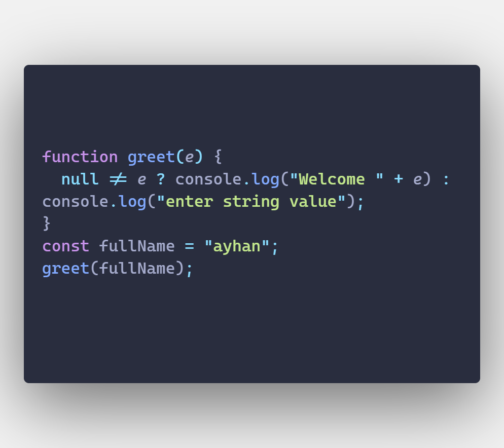

# What is Gulp.js ?


### Gulp.js is perfect for Front-End developers. It is a Node.js based javascript tool that automates the workflow. With the help of Gulp.js, we can automate the processes that require a lot of effort .

- It is open source javascript tool
- Task runner or task runner.
- Works with nodejs or npm
- Frontend build tool
- Used for repetitive or time-consuming operations

### When using gulp, the basic logic is as follows, first a gulpfile.js file is created, this is the page with the operations you will do with gulp. Then you work in src, when your last process is finished, we will present the site to the live model, and you send the final version to the dist folder with gulp.

# Gulp dowland

- one step

```js
npm install -g gulp
```

- two step

#### create new folder

- three step

```jsx
- step one => npm init
- step two => npm install --save-g gulp
```

- four step

### create 'gulpfile.js'

```jsx
// gulp.task => create a  of task

// gulp.src  => source files

// gulp.test => target directory

// gulp.watch => monitoring and works task

// pipe => modify
```


```js
gulp 'taskName'
```


### gulp with file and folder transfer process

```js
gulp.task("transferImg", () => {
  gulp.src("./img/*").pipe(gulp.dest("./dist/images"));
});

gulp.task("transferHtml", () => {
  gulp.src("./src/*.html").pipe(gulp.dest("./dist/public"));
});
```

# Gulp Imagemin

### Gulp.js is an open source library that allows us to reduce the size of images.

- Dowland

```js
npm install --save-dev gulp-imagemin
```

```js
import imagemin from "gulp-imagemin";
gulp.task("copy", () => {
  gulp.src("./*.png").pipe(imagemin()).pipe(gulp.dest("./dist/images"));
});
```

# gulp-uglify

### UglifyJS is a JavaScript parser/compressor/beautifier toolkit. It can be used to combine and minify JavaScript assets so that they require less HTTP requests and make your site load faster.

- dowland

```js
npm install --save-dev gulp-uglify
```

```js
gulp.task("minJs", () => {
  gulp
    .src("./src/scripts/*")
    .pipe(GulpUglify())
    .pipe(gulp.dest("./dist/scripts"));
});
```

<div style="display: flex;">
 <div style="width:50%">
   <h1>Enter value</h1>
  </div>
 <div style="width:50%">
   <h1>Output</h1>
  </div>
</div>

<br/>
<br/>

# gulp-clean-css

### It minifies (compresses) css files by removing unnecessary spaces, thus minimizing the file size.

- dowland

```jsx
npm install gulp-clean-css --save-dev
```

```js
gulp.task("cssMin", () => {
  gulp
    .src("./src/style/*.css")
    .pipe(GulpCleanCss())
    .pipe(gulp.dest("./dist/style"));
});
```

<div style="display: flex;">
 <div style="width:50%">
   <h1>Enter value</h1>
  </div>
 <div style="width:50%">
   <h1>Output</h1>
  </div>
</div>
